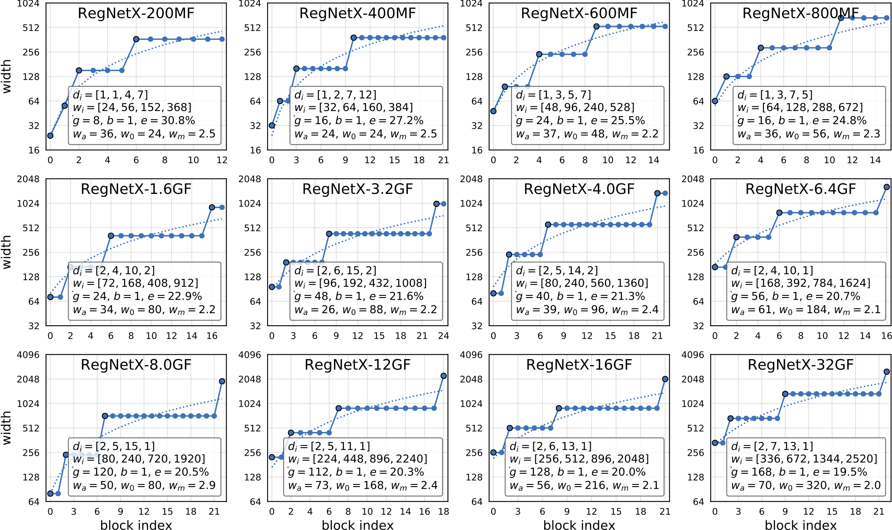

# pycls

**pycls** is an image classification codebase, written in [PyTorch](https://pytorch.org/). It was originally developed for the [On Network Design Spaces for Visual Recognition](https://arxiv.org/abs/1905.13214) project. **pycls** has since matured and been adopted by a number of [projects](#projects) at Facebook AI Research.

<div align="center">
  
  <p align="center"><b>pycls</b> provides a large set of baseline models across a wide range of flop regimes.</p>
</div>

## Introduction

The goal of **pycls** is to provide a simple and flexible codebase for image classification. It is designed to support rapid implementation and evaluation of research ideas. **pycls** also provides a large collection of baseline results ([Model Zoo](MODEL_ZOO.md)).

The codebase supports efficient single-machine multi-gpu training, powered by the PyTorch distributed package, and provides implementations of standard models including [ResNet](https://arxiv.org/abs/1512.03385), [ResNeXt](https://arxiv.org/abs/1611.05431), [EfficientNet](https://arxiv.org/abs/1905.11946), and [RegNet](https://arxiv.org/abs/2003.13678).

## Using pycls

Please see [`GETTING_STARTED`](docs/GETTING_STARTED.md) for brief installation instructions and basic usage examples.

## Model Zoo

We provide a large set of baseline results and pretrained models available for download in the **pycls** [Model Zoo](MODEL_ZOO.md); including the simple, fast, and effective [RegNet](https://arxiv.org/abs/2003.13678) models that we hope can serve as solid baselines across a wide range of flop regimes.

## Projects

A number of projects at FAIR have been built on top of **pycls**:

- [On Network Design Spaces for Visual Recognition](https://arxiv.org/abs/1905.13214)
- [Exploring Randomly Wired Neural Networks for Image Recognition](https://arxiv.org/abs/1904.01569)
- [Designing Network Design Spaces](https://arxiv.org/abs/2003.13678)
- [Are Labels Necessary for Neural Architecture Search?](https://arxiv.org/abs/2003.12056)
- [PySlowFast Video Understanding Codebase](https://github.com/facebookresearch/SlowFast)

If you are using **pycls** in your research and would like to include your project here, please let us know or send a PR.

## Citing pycls

If you find **pycls** helpful in your research or refer to the baseline results in the [Model Zoo](MODEL_ZOO.md), please consider citing an appropriate subset of the following papers:

```
@InProceedings{Radosavovic2019,
  title = {On Network Design Spaces for Visual Recognition},
  author = {Radosavovic, Ilija and Johnson, Justin and Xie, Saining and Lo, Wan-Yen and Doll{\'a}r, Piotr},
  booktitle = {ICCV},
  year = {2019}
}

@InProceedings{Radosavovic2020,
  title = {Designing Network Design Spaces},
  author = {Radosavovic, Ilija and Kosaraju, Raj Prateek and Girshick, Ross and He, Kaiming and Doll{\'a}r, Piotr},
  booktitle = {CVPR},
  year = {2020}
}
```

## License

**pycls** is released under the MIT license. Please see the [LICENSE](LICENSE) file for more information.

## Contributing

We actively welcome your pull requests! Please see [`CONTRIBUTING.md`](docs/CONTRIBUTING.md) and [`CODE_OF_CONDUCT.md`](docs/CODE_OF_CONDUCT.md) for more info.
